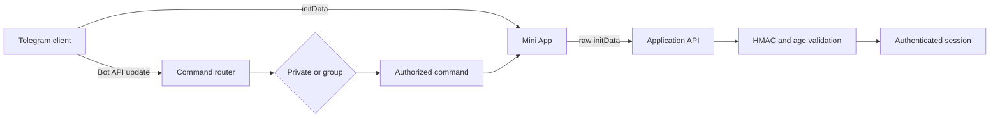

<div align="center">

# Telegram Mini App Starter

### A production-minded Mini App shell with verified sessions and group-safe bot commands.

   

</div>

This starter demonstrates the full interaction boundary around a Telegram product: a native-feeling mobile interface, Telegram theme and viewport integration, backend `initData` verification, and commands that continue to work when the bot is added to a group.

The included **Creator Desk** is a real browser-runnable interface, not a static mockup. It works in Telegram and provides a preview mode during local development.

## Included

- responsive Mini App UI with Home, Activity, and Profile views;
- Telegram color variables, stable viewport height, and safe-area insets;
- `ready()`, `expand()`, theme events, viewport events, and haptic feedback;
- server-side HMAC verification for raw `initData`;
- timestamp checks against replayed sessions;
- direct and `@botname` command parsing;
- private/group-aware responses;
- server-side authorization for an admin command;
- tests and a production build workflow.

## Architecture



## Mini App lifecycle

[`src/telegram.ts`](src/telegram.ts) keeps the Telegram bridge small. The app signals readiness only after JavaScript has loaded, expands when appropriate, listens for theme and viewport changes, and leaves a browser fallback for normal frontend work.

The layout uses:

```css
min-height: var(--tg-viewport-stable-height, 100vh);
padding-top: max(18px, env(safe-area-inset-top));
```

This avoids bottom controls jumping with Telegram's animated viewport and prevents fullscreen UI from colliding with device cutouts.

## Authentication boundary

`initDataUnsafe` helps render a fast greeting, but it is not authorization. The client sends the untouched `Telegram.WebApp.initData` string to the server. [`server/validate-init-data.ts`](server/validate-init-data.ts) then:

1. extracts the supplied hash;
2. sorts the remaining fields into Telegram's data-check string;
3. derives the secret from the bot token and `WebAppData`;
4. verifies HMAC-SHA-256 without an early-exit comparison;
5. rejects old or implausibly future `auth_date` values;
6. parses user data only after integrity succeeds.

Never ship the bot token in frontend code.

## Commands in chats

[`bot/commands.ts`](bot/commands.ts) supports both private and group use:

| Command | Behavior |
| --- | --- |
| `/app` | Returns an explicit action to open the Mini App |
| `/status` | Uses private or group-specific copy |
| `/help` | Shows the supported command set |
| `/sync` | Checks server-side admin authorization |

In groups, `/status@creator_bot` is accepted while commands addressed to another bot are ignored. Command scopes improve Telegram's menu, but the backend still validates every received command and its permissions.

Telegram privacy mode can remain enabled for this command-driven design. The bot does not need to read ordinary group conversation.

## UI rationale

- The first viewport is the working product, not a landing page.
- The layout stays narrow and thumb-friendly in Telegram but remains usable in a browser.
- Theme colors come from Telegram, while spacing and hierarchy remain product-owned.
- Three stable bottom destinations match repeated use without crowding the screen.
- The primary action is contextual and singular.
- Status uses text plus color, never color alone.
- Motion respects `prefers-reduced-motion`.
- Cards are limited to the summary; list content remains easy to scan.

## Run locally

```bash
npm install
npm test
npm run dev
```

Open the local URL in a browser for preview mode. For Telegram testing, expose an HTTPS URL, configure the Mini App in BotFather, and open it through the bot.

Production build:

```bash
npm run build
npm run preview
```

## Bot setup checklist

1. Create a bot in BotFather and configure its Mini App URL.
2. Store the bot token only in the server secret manager.
3. Register private and group command scopes with `setMyCommands`.
4. Keep privacy mode enabled unless the product truly requires ordinary messages.
5. Verify commands and admin status server-side regardless of the visible menu.
6. Use HTTPS and a strict Content Security Policy in production.
7. Rate-limit session exchange and command handlers.
8. Log update IDs for idempotent Bot API processing.

## Verification

The test suite covers valid, modified, expired, and future Mini App sessions; direct and mentioned commands; cross-bot command isolation; admin authorization; and Mini App action responses. CI also creates the real Vite production bundle.

## References

- [Telegram Mini Apps](https://core.telegram.org/bots/webapps)
- [Telegram bot features and privacy mode](https://core.telegram.org/bots/features)
- [Telegram Bot API commands](https://core.telegram.org/bots/api#setmycommands)

## Scope

This starter intentionally omits a live bot token, hosted backend, database, analytics identifiers, and production product logic. Example names and activity are local demo data.

## Author

Built by [0xENTYPER](https://github.com/0xENTYPER).
